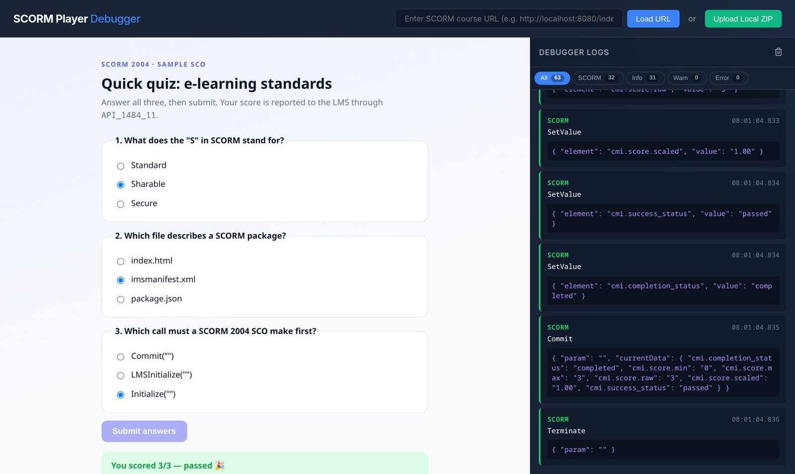
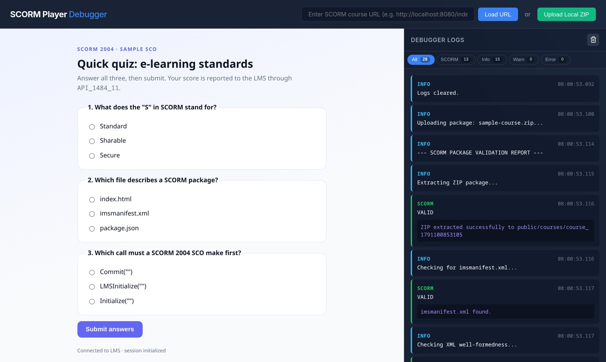

<div align="center">


# SCORM Player & Debugger

**A local test harness for e-learning content.** Drop in a SCORM package and it validates the manifest against the official ADL schemas, runs the course, and shows every LMS API call, console message and error as it happens.

[](https://github.com/happinessisreal/scormplayer/actions/workflows/ci.yml)
[](vite.config.js)
[](#-what-it-checks)
[](LICENSE)



</div>

## ✨ Features

- **Upload a `.zip` or load a URL.** Packages are extracted, validated and launched in one step.
- **Both SCORM runtimes.** The SCORM 1.2 `API` and SCORM 2004 `API_1484_11` are exposed where courses look for them: on the player window, through `window.parent` discovery, and inside same-origin course frames. Every launch gets a **fresh session**, so relaunching a course works the way it would in a real LMS.
- **Live debugger.** Every `Initialize`/`LMSInitialize`, `GetValue`, `SetValue`, `Commit` and `Terminate` call is logged with its arguments and the current `cmi` data. The course's `console.*` output, uncaught exceptions and promise rejections are captured too.
- **Filter by type** (All / SCORM / Info / Warn / Error), with live counts.
- **Manifest validation report.** It checks:
  - XML well-formedness, with line numbers
  - **XSD validation** against the bundled ADL SCORM 2004 4th Edition schemas (via `xmllint`)
  - the default organization, items and resources
  - the launch file
  - that every referenced file is present
- **Sample course included.** A small SCORM 2004 quiz that reports completion, score and pass/fail, so you can see a full session straight away.

<p align="center"></p>

## 🚀 Quick start

```bash
git clone https://github.com/happinessisreal/scormplayer.git
cd scormplayer
npm install          # or: bun install
npm run dev          # → http://localhost:5173
```

Then click **Upload Local ZIP** and pick [`examples/sample-course.zip`](examples/sample-course.zip). To try a SCORM 1.2 course, enter `/dummy-course.html` in the URL box instead.

**Requirements:** Node.js 20.19+ (Vite 8). For XSD validation you also need `xmllint` from libxml2. It's preinstalled on macOS; on Debian/Ubuntu run `apt install libxml2-utils`. Without it, the schema step is skipped with a warning and every other check still runs.

## 🔍 What it checks

| Step | Result on failure |
|---|---|
| `imsmanifest.xml` exists at the package root | error, or falls back to `index.html` |
| XML is well-formed | rejected, with the line number |
| Conforms to the ADL XSDs (`imscp_v1p1`, `adlcp_v1p3`, `imsss`, …) | reported, but still launches |
| `<manifest identifier>`, `xmlns`, `<organizations default>` and the matching organization | reported |
| Launch resource: the first item's `identifierref`, else the first resource with an `href` | rejected if none is found |
| Every `<file href>` exists | warning per missing file |

The validator is a plain function, [`validatePackage(dir)`](server/validate-package.js), so you can reuse it in scripts or CI.

## 🧱 How it works

```
browser ──upload .zip──▶ Vite dev server ── /api/upload (scorm-plugin.js)
                           │  extract → public/courses/<id>/
                           │  validatePackage() → launch URL + report
                           ▼
player page ── <iframe src=/courses/<id>/index.html>
   window.API, window.API_1484_11 ◀── course finds the LMS via window.parent
   console / error interceptors   ◀── same-origin frames only
```

| Path | Role |
|---|---|
| [`src/main.js`](src/main.js) | UI wiring, upload, course loading, iframe interceptors |
| [`src/scorm-api.js`](src/scorm-api.js) | SCORM 1.2 + 2004 API shims, per-launch sessions |
| [`src/logger.js`](src/logger.js) | Debugger log panel and filters |
| [`scorm-plugin.js`](scorm-plugin.js) | Vite middleware: upload and extraction |
| [`server/validate-package.js`](server/validate-package.js) | Manifest and package validation |
| [`schemas/`](schemas) | ADL SCORM 2004 4th Edition XSDs (patched for offline `--nonet` use) |
| [`examples/sample-course/`](examples/sample-course) | Sample SCO (rebuild the zip with `npm run pack-sample`) |

> **Note:** uploading needs the dev server (`npm run dev`). `npm run build` produces a static player that can only load courses by URL.

## 🧪 Tests

```bash
npm test      # node:test suite for the package validator
```

## 📄 License

[MIT](LICENSE). The XSD files in `schemas/` are © ADL / IMS Global and keep their own terms.
